# AI and Retrieval Pipeline Diagram

## Status

- Status: Canonical
- Version: 1.1
- Last Updated: 2026-07-16

## Authority

This is the canonical AI and retrieval pipeline diagram for F1 baseline behavior.

## Scope

This diagram defines retrieval and AI-assisted recommendation flow with evidence and citation controls.

## Terminology

Canonical terms are defined in [../specification/002 GLOSSARY.md](../specification/002%20GLOSSARY.md) and [../specification/008 AI_PRINCIPLES.md](../specification/008%20AI_PRINCIPLES.md).

```mermaid
flowchart LR
    ISSUE[Issue] -->|Current baseline: deterministic template| DRAFT[Draft RecommendationArtifact]
    DRAFT --> VALIDATE[Policy, Schema, Citation and Publication Validator]

    DRAFT -.->|Optional AI-assisted request| PRECALL[Pre-call Provider, Data-handling and Safety Gate]
    PRECALL -->|Approved signed artifacts only| RETRIEVE[Retrieval Adapter]
    RETRIEVE --> EVIDENCE[Frozen Eligible Evidence Set]
    EVIDENCE --> PROMPT[Bounded Prompt Builder]
    PROMPT --> MODEL[Approved AI Provider]
    MODEL --> RESPONSE[AIResponse]
    RESPONSE --> CITE[Proposed Citations]
    CITE --> VALIDATE

    PRECALL -->|Denied or unavailable: no provider call| FALLBACK[Use Deterministic Draft]
    FALLBACK --> VALIDATE
    VALIDATE -->|All predicates pass| PUBLISH[Published RecommendationArtifact]
    VALIDATE -->|Validation fails| REJECT[Remain Draft or Reject AIResponse]
```

The solid deterministic-template route is the current baseline. The dashed AI-assisted route is optional and remains closed unless active signed provider/model, data-handling, Evidence-classification, prompt, output-schema, and safety artifacts pass the pre-call gate. Provider access occurs only after that gate; no failure silently weakens the deterministic publication predicates.

## Related Documents

- [../specification/008 AI_PRINCIPLES.md](../specification/008%20AI_PRINCIPLES.md)
- [../specification/014 SECURITY_MODEL.md](../specification/014%20SECURITY_MODEL.md)
- [../specification/018 OBSERVABILITY.md](../specification/018%20OBSERVABILITY.md)
