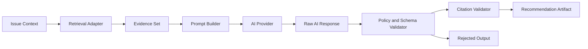

# AI and Retrieval Pipeline Diagram

## Status

- Status: Canonical
- Version: 1.0
- Last Updated: 2026-07-15

## Authority

This is the canonical AI and retrieval pipeline diagram for F1 baseline behavior.

## Scope

This diagram defines retrieval and AI-assisted recommendation flow with evidence and citation controls.

## Terminology

Canonical terms are defined in [../specification/002 GLOSSARY.md](../specification/002%20GLOSSARY.md) and [../specification/008 AI_PRINCIPLES.md](../specification/008%20AI_PRINCIPLES.md).

## Related Documents

- [../specification/008 AI_PRINCIPLES.md](../specification/008%20AI_PRINCIPLES.md)
- [../specification/014 SECURITY_MODEL.md](../specification/014%20SECURITY_MODEL.md)
- [../specification/018 OBSERVABILITY.md](../specification/018%20OBSERVABILITY.md)
