# Component Architecture Diagram

## Status

- Status: Canonical
- Version: 1.1
- Last Updated: 2026-07-16

## Authority

This is the canonical component architecture diagram for baseline F1 workflows.

## Scope

This diagram defines major components and orchestration pathways for crawl to recommendation lifecycle.

## Terminology

Canonical terms are defined in [../specification/002 GLOSSARY.md](../specification/002%20GLOSSARY.md).

```mermaid
flowchart LR
    ONB[Onboarding Component] --> INTAKE[Intake Orchestrator]
    INTAKE --> CRAWL[Crawl Engine]
    CRAWL --> INGEST[Ingestion Component]
    INGEST --> PARSE[Parsing Component]
    PARSE --> INPUT[Sealed Evaluation Input Snapshot]
    PARSE -->|Independent non-gating projection| INDEX[Indexing Component]
    INPUT --> EVAL[Evaluation Engine]
    EVAL --> ISSUE[Issue Prioritization Component]
    ISSUE --> REC[Recommendation Artifact Generator]
    REC -->|Current baseline: deterministic template| DRAFT[Draft RecommendationArtifact]
    DRAFT -.->|Only with approved provider and safety artifacts| AIORCH[AI Orchestration Component]
    AIORCH --> AIR[AIResponse]
    AIR --> CITE[Citation Validator]
    CITE --> VALIDATE
    DRAFT --> VALIDATE[Policy, Schema and Publication Validator]
    VALIDATE --> REPORT[Reporting and Export Component]
```

Parsing feeds the sealed Evaluation input snapshot directly. Indexing is a bounded, independently recoverable projection and never gates Evaluation input readiness. Deterministic-template generation is the current Recommendation baseline; the AI branch is unavailable until the required signed provider, model, data-handling, and safety artifacts are active.

## Related Documents

- [../specification/011 DOMAIN_MODEL.md](../specification/011%20DOMAIN_MODEL.md)
- [../specification/016 STATE_MODEL.md](../specification/016%20STATE_MODEL.md)
- [../specification/017 ERROR_MODEL.md](../specification/017%20ERROR_MODEL.md)
