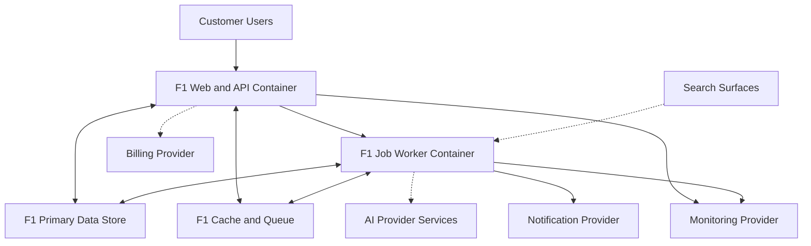

# Container Architecture Diagram

## Status

- Status: Canonical
- Version: 1.0
- Last Updated: 2026-07-15

## Authority

This is the canonical container architecture diagram for F1 baseline architecture.

## Scope

This diagram shows runtime containers and primary data and integration flows without implementation internals.

## Edge Notation

A solid edge is an active baseline path. A dotted edge is a gated or dormant boundary that the accepted baseline does not exercise, matching [SYSTEM_CONTEXT.md](SYSTEM_CONTEXT.md) and [AI_RETRIEVAL_PIPELINE.md](AI_RETRIEVAL_PIPELINE.md). Volume I owns the governing behaviour; where this diagram and a Volume I contract disagree, Volume I governs.

The Search Surfaces, AI Provider, and Billing Provider edges are dotted and the Search Surfaces edge is inbound, for the reasons recorded in [SYSTEM_CONTEXT.md](SYSTEM_CONTEXT.md).

## Terminology

Canonical terms are defined in [../specification/003 TERMINOLOGY.md](../specification/003%20TERMINOLOGY.md).

## Related Documents

- [../specification/007 ARCHITECTURE_PRINCIPLES.md](../specification/007%20ARCHITECTURE_PRINCIPLES.md)
- [../specification/018 OBSERVABILITY.md](../specification/018%20OBSERVABILITY.md)
