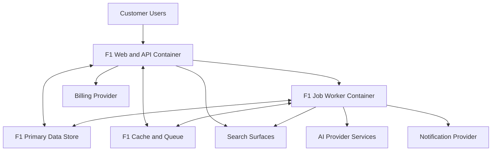

# Container Architecture Diagram

## Status

- Status: Canonical
- Version: 1.0
- Last Updated: 2026-07-15

## Authority

This is the canonical container architecture diagram for F1 baseline architecture.

## Scope

This diagram shows runtime containers and primary data and integration flows without implementation internals.

## Terminology

Canonical terms are defined in [../specification/003 TERMINOLOGY.md](../specification/003%20TERMINOLOGY.md).

## Related Documents

- [../specification/007 ARCHITECTURE_PRINCIPLES.md](../specification/007%20ARCHITECTURE_PRINCIPLES.md)
- [../specification/018 OBSERVABILITY.md](../specification/018%20OBSERVABILITY.md)
