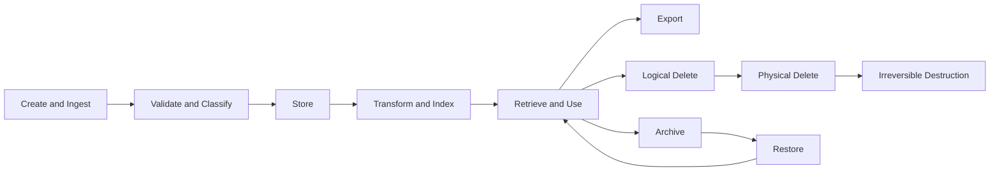

# Data Lifecycle Diagram

## Status

- Status: Canonical
- Version: 1.0
- Last Updated: 2026-07-15

## Authority

This is the canonical data lifecycle diagram for F1.

## Scope

This diagram defines lifecycle stages for major data classes from creation through destruction.

## Terminology

Canonical terms are defined in [../specification/015 DATA_LIFECYCLE.md](../specification/015%20DATA_LIFECYCLE.md).

## Related Documents

- [../specification/015 DATA_LIFECYCLE.md](../specification/015%20DATA_LIFECYCLE.md)
- [../specification/019 VERSIONING.md](../specification/019%20VERSIONING.md)
