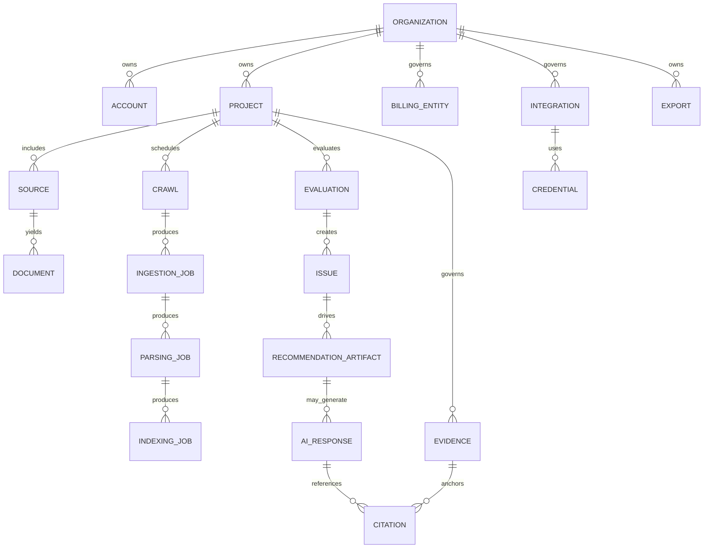

# Domain Model Diagram

## Status

- Status: Canonical
- Version: 1.0
- Last Updated: 2026-07-16

## Authority

This is the canonical domain model diagram for F1.

## Scope

This diagram visualizes core domain entities and primary relationships defined in [../specification/011 DOMAIN_MODEL.md](../specification/011%20DOMAIN_MODEL.md).

## Terminology

Canonical terms are defined in [../specification/002 GLOSSARY.md](../specification/002%20GLOSSARY.md).

`EVIDENCE` is the auxiliary immutable governed Evidence record owned by Evidence Context, not an additional DM-REQ-001 core entity. Evidence Type, Evidence Payload, Evidence Provenance, and Evidence Classification are not separate entities; Evidence Source is the nonpersisted origin view over Provenance. Audit Evidence is a separate audit/security record and is not represented by `EVIDENCE`.

## Related Documents

- [../specification/011 DOMAIN_MODEL.md](../specification/011%20DOMAIN_MODEL.md)
- [../specification/016 STATE_MODEL.md](../specification/016%20STATE_MODEL.md)
