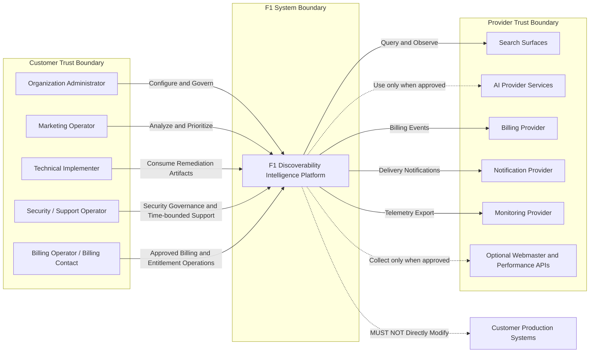

# System Context Diagram

## Status

- Status: Canonical
- Version: 1.1
- Last Updated: 2026-07-16

## Authority

This is the canonical system context diagram for F1.

## Scope

This diagram defines external actors, external systems, trust boundaries, and responsibility edges for the current baseline scope.

## Terminology

Canonical terms are defined in [../specification/002 GLOSSARY.md](../specification/002%20GLOSSARY.md) and [../specification/003 TERMINOLOGY.md](../specification/003%20TERMINOLOGY.md).

Support work is performed through the governed, time-bounded SecurityOperator support session; `SupportOperator` is not a standing authorization role. Billing Contact is the external actor class represented by the canonical Billing Operator role for authorized product actions.

## Related Documents

- [../specification/012 SYSTEM_BOUNDARIES.md](../specification/012%20SYSTEM_BOUNDARIES.md)
- [../specification/014 SECURITY_MODEL.md](../specification/014%20SECURITY_MODEL.md)
